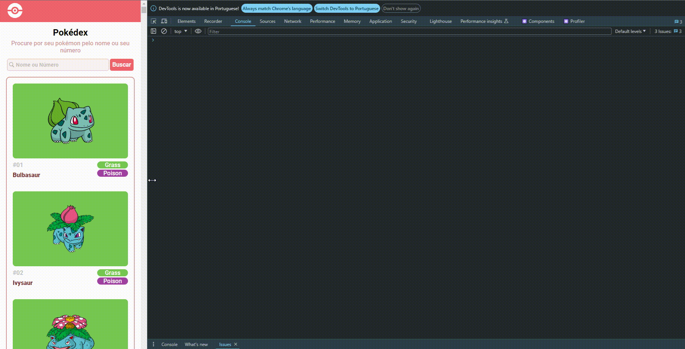

# 🧠 React Pokédex


> Uma enciclopédia interativa dos Pokémon feita com amor em React.js ⚡

---

## 🎥 Demonstração

<!-- Substitua o caminho abaixo pelo caminho do seu GIF (ex: ./public/demo.gif ou ./assets/pokedex-demo.gif) -->
<p align="center">
  
</p>

---

## 📚 Sobre o Projeto

A **React Pokédex** é uma aplicação web construída com React.js que consome dados da [PokéAPI](https://pokeapi.co/) para exibir informações completas sobre os monstrinhos mais famosos do mundo!

Você poderá:
- 🔍 Pesquisar seus Pokémon favoritos
- 📋 Visualizar detalhes como tipos, status e evolução
- 🎨 Alternar entre temas claro e escuro
- 🔄 Navegar entre diferentes gerações (em breve...)

---

## 🚀 Tecnologias Utilizadas

- ⚛️ **React.js** – Biblioteca principal para construção da interface
- 🧪 **Vitest** – Para testes unitários
- 💅 **styled-components** – Estilização com suporte a temas
- 🔁 **React Router DOM** – Navegação entre páginas
- 📦 **Axios** – Requisições HTTP à PokéAPI
- 💡 **TypeScript** – Tipagem estática e segurança em tempo de desenvolvimento

---

## 🧠 Estrutura do Projeto

```bash
react-pokedex/
├── public/
├── src/
│   ├── assets/
│   ├── components/
│   ├── contexts/
│   ├── hooks/
│   ├── pages/
│   ├── services/
│   ├── styles/
│   └── utils/
├── tests/
├── .eslintrc.cjs
├── vitest.config.ts
└── README.md
